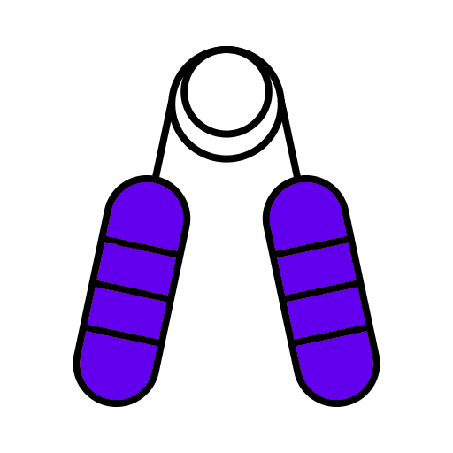

<p align="center">
    
    <h1 align="center">Grip App</h1>
</p>

<h4 align="center">GeOM client application for on-site operators.</h4>

<br />

<p align="center">
    
    
    
    
</p>

<p align="center">
  <a href="https://play.google.com/store/apps/details?id=com.nexioinformatica.grip.app">
    
  </a>
</p>

<br />

## Table of Contents

- [The project](#the-project)
- [Try it on Expo](#try-it-on-expo)
- [Build it yourself](#build-it-yourself)
- [Related projects](#related-projects)
- [Credits](#credits)

## 💡 The project

This is the project for GeOM's app for on-site operators. The application is an interface to the management system, and it's possibly simple to use, easy to setup and install, fault tolerant, and very focused on some tasks.

## 📱 Try it on Expo

This app is bootstrapped with [Expo](https://expo.io). You can download the Expo app on the [Play Store](https://play.google.com/store/apps/details?id=host.exp.exponent), and enter the url provided below. We have 2 release channels:

| Release Channel                                                                       | Version | Description                                                                 | Url                                                             |
| ------------------------------------------------------------------------------------- | ------- | --------------------------------------------------------------------------- | --------------------------------------------------------------- |
| [Production](https://expo.io/@lparolari/projects/grip-app?release-channel=production) | 1.0.0   | Same version as Grip App on Play Store.                                     | `exp://exp.host/@lparolari/grip-app?release-channel=production` |
| [Staging](https://expo.io/@lparolari/projects/grip-app?release-channel=default)       | 1.0.0   | Latest version currently in development: newest features, may contain bugs. | `exp://exp.host/@lparolari/grip-app?release-channel=default`    |

## 🔨 Build it yourself

```bash
# Clone this repo
git clone https://github.com/nexioinformatica/grip-app cd grip-app

# Install dependencies
yarn

# Copy the file that contains secrets
cp .env.example .env
# and generate the manifest (app.json)
yarn gen:manifest

# Run the app with Expo
yarn start
```

The [Expo](https://expo.io) packager will show, and you can either:

- install the Expo app, scan the displayed QR code, and run the app on your mobile phone directly.
- open the Android simulator.
- open the iOS simulator.

## ⭐ Related projects

- [geom-api-ts-client](https://github.com/nexioinformatica/geom-api-ts-client)

## ❤️ Credits

- [Luca Parolari](https://github.com/lparolari)
- [All contributors](https://github.com/nexioinformatica/grip-app/contributors)

A project by NEXIO INFORMATICA srl

Visit us at [nexioinformatica.com](https://nexioinformatica.com) or get in touch with [info@nexioinformatica.com](mailto:info@nexioinformatica.com).


## 📋 License

Proprietary.
